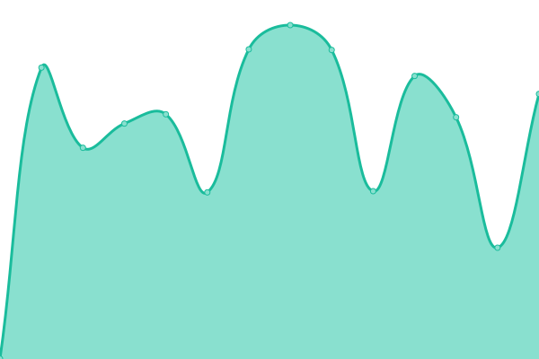
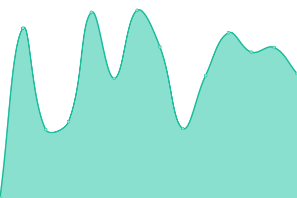
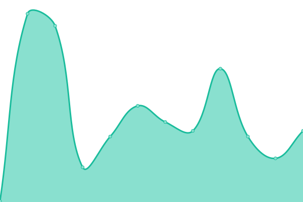

# [📈 Live Status](https://demo.upptime.js.org): <!--live status--> **🟩 All systems operational**

This repository contains the open-source uptime monitor and status page for [Lazy*boy*](lazy-boy-acmer.cn), powered by [Upptime](https://github.com/upptime/upptime).

With [Upptime](https://upptime.js.org), you can get your own unlimited and free uptime monitor and status page, powered entirely by a GitHub repository. We use [Issues](https://github.com/santisify/uptime/issues) as incident reports, [Actions](https://github.com/santisify/uptime/actions) as uptime monitors, and [Pages](https://demo.upptime.js.org) for the status page.

<!--start: status pages-->
<!-- This summary is generated by Upptime (https://github.com/upptime/upptime) -->
<!-- Do not edit this manually, your changes will be overwritten -->
<!-- prettier-ignore -->
| URL | Status | History | Response Time | Uptime |
| --- | ------ | ------- | ------------- | ------ |
|  [anzhiyu-LB](https://anzhiyublog.lazy-boy-acmer.cn/) | 🟩 Up | [anzhiyu-lb.yml](https://github.com/santisify/uptime/commits/HEAD/history/anzhiyu-lb.yml) | 

 849ms
     
 | 

<a href="https://uptime.lazy-boy-acmer.cn/history/anzhiyu-lb">100.00%</a>
    

|  [twikoo评论系统](https://twikoo.lazy-boy-acmer.cn/) | 🟩 Up | [twikoo.yml](https://github.com/santisify/uptime/commits/HEAD/history/twikoo.yml) | 

 2259ms
     
 | 

<a href="https://uptime.lazy-boy-acmer.cn/history/twikoo">100.00%</a>
    

|  [butterfly-LB](https://blog.lazy-boy-acmer.cn/) | 🟩 Up | [butterfly-lb.yml](https://github.com/santisify/uptime/commits/HEAD/history/butterfly-lb.yml) | 

 604ms
     
 | 

<a href="https://uptime.lazy-boy-acmer.cn/history/butterfly-lb">100.00%</a>
    

|  [index](https://lazy-boy-acmer.cn/) | 🟩 Up | [index.yml](https://github.com/santisify/uptime/commits/HEAD/history/index.yml) | 

 625ms
     
 | 

<a href="https://uptime.lazy-boy-acmer.cn/history/index">100.00%</a>
    

|  [anzhiyu-LB(github)](https://santisify.github.io/) | 🟩 Up | [anzhiyu-lb-github.yml](https://github.com/santisify/uptime/commits/HEAD/history/anzhiyu-lb-github.yml) | 

 125ms
     
 | 

<a href="https://uptime.lazy-boy-acmer.cn/history/anzhiyu-lb-github">99.74%</a>
    

<!--end: status pages-->

[**Visit our status website →**](https://demo.upptime.js.org)

## 📄 License

- Powered by: [Upptime](https://github.com/upptime/upptime)
- Code: [MIT](./LICENSE) © [Anand Chowdhary](https://anandchowdhary.com), supported by [Pabio](https://pabio.com)
- Data in the `./history` directory: [Open Database License](https://opendatacommons.org/licenses/odbl/1-0/)
